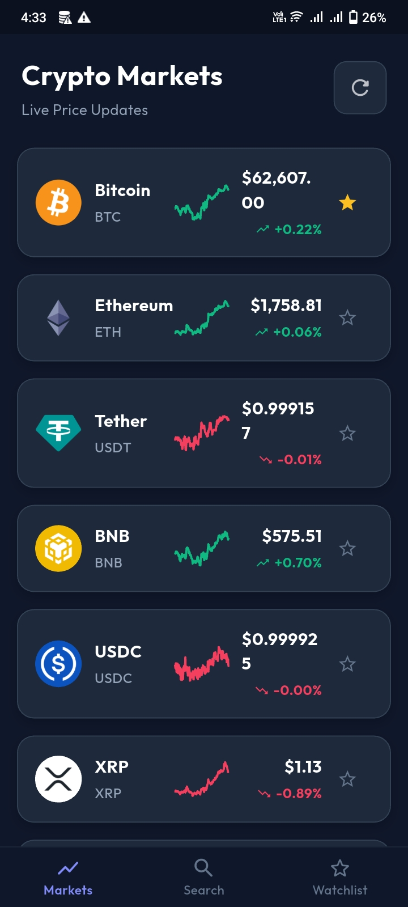
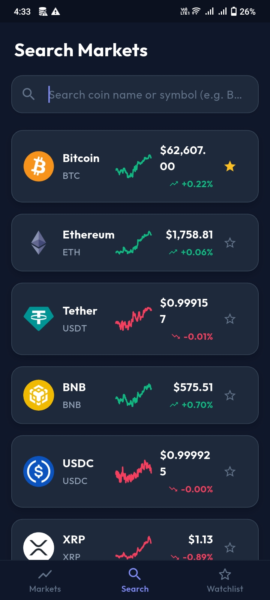
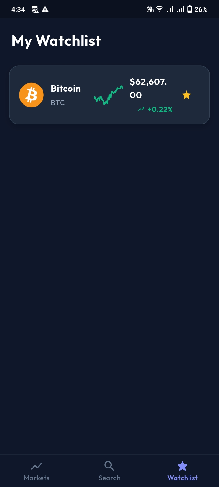

# 📈 Crypto Tracker

A modern Flutter application that provides real-time cryptocurrency prices, market trends, and detailed coin information using REST APIs. The app helps users monitor the crypto market and make informed trading and investment decisions through an intuitive and responsive user interface.

---

## ✨ Features

- 📊 View live cryptocurrency prices
- 📈 Track market trends in real time
- 🔍 Search cryptocurrencies instantly
- 📱 Responsive Grid and List view layouts
- 📄 Detailed cryptocurrency information
- ⚡ Fast API integration with live market updates
- 🎨 Clean and modern Flutter UI

---

## 🛠 Tech Stack

- Flutter
- Dart
- REST API
- HTTP Package
- JSON Parsing
- Stateful Widgets
- GridView & ListView
- Material Design

---

## 📸 Screenshots

### 🏠 Home Screen



### 🔍 Search Screen



### ❤️ Watchlist



---

## 📂 Project Structure

```
lib/
├── models/
├── screens/
├── services/
├── widgets/
├── main.dart
```

---

## 🚀 Getting Started

### Prerequisites

- Flutter SDK
- Android Studio or VS Code
- Android Emulator or Physical Device

### Installation

1. Clone the repository

```bash
git clone https://github.com/Azanshahzad/crypto-tracker.git
```

2. Navigate to the project directory

```bash
cd crypto-tracker
```

3. Install dependencies

```bash
flutter pub get
```

4. Run the application

```bash
flutter run
```

---

## 📌 Future Improvements

- User Authentication
- Favorite Coins Synchronization
- Price Alert Notifications
- Portfolio Management
- Dark & Light Theme
- Market News Integration

---

## 👨‍💻 Developer

**Azan Shahzad**

- GitHub: https://github.com/Azanshahzad
- LinkedIn: https://www.linkedin.com/in/azan-shahzad

---

## ⭐ Support

If you like this project, don't forget to ⭐ star the repository.